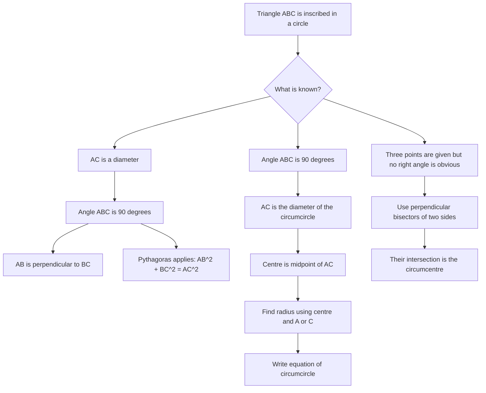

# AS1CoordinateGeometryCirclesMermaid-007

## Asset Metadata

| Field | Value |
|---|---|
| Asset ID | AS1CoordinateGeometryCirclesMermaid-007 |
| Unit code | AS1 |
| Topic code | AS1-CG |
| Topic name | Co-ordinate geometry in the \(x,y\) plane |
| Lesson focus | Circles |
| Source | Chapter 6 Circles PDF, page 24 onwards; Chapter 6 Circles transcript, Circles 7 and Circles 8 |
| Related lesson section | Core Theory: Angle in a semicircle; Worked circumcircle examples |
| Purpose | Show the relationship between a right angle in an inscribed triangle and a diameter of the circumcircle. |
| CCEA alignment | AS1-CG-LO002, AS1-CG-LO005, AS1-CG-LO007 |

## Mermaid Diagram

