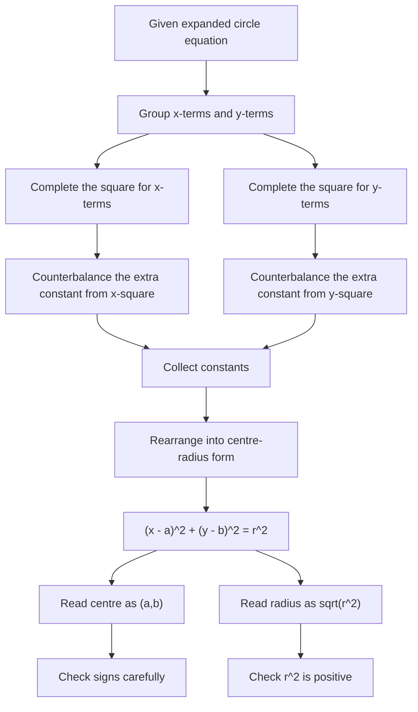

# AS1CoordinateGeometryCirclesMermaid-008

## Asset Metadata

| Field | Value |
|---|---|
| Asset ID | AS1CoordinateGeometryCirclesMermaid-008 |
| Unit code | AS1 |
| Topic code | AS1-CG |
| Topic name | Co-ordinate geometry in the \(x,y\) plane |
| Lesson focus | Circles |
| Source | Chapter 6 Circles PDF, pages 11-12; Chapter 6 Circles transcript, Circles 3 |
| Related lesson section | Core Theory: Completing the square for circle equations |
| Purpose | Show the exact method for changing an expanded circle equation into centre-radius form. |
| CCEA alignment | AS1-CG-LO005, AS1-CG-LO006, AS1-AF-LO005 |

## Mermaid Diagram

