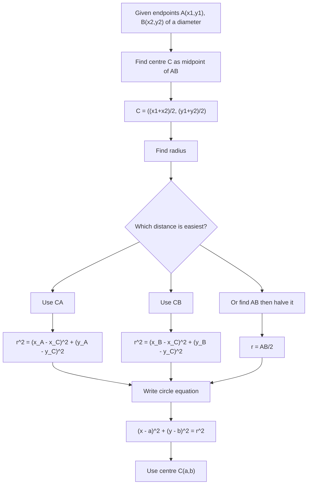

# AS1CoordinateGeometryCirclesMermaid-009

## Asset Metadata

| Field | Value |
|---|---|
| Asset ID | AS1CoordinateGeometryCirclesMermaid-009 |
| Unit code | AS1 |
| Topic code | AS1-CG |
| Topic name | Co-ordinate geometry in the \(x,y\) plane |
| Lesson focus | Circles |
| Source | Chapter 6 Circles PDF, pages 9-10; Chapter 6 Circles transcript, Circles 2 |
| Related lesson section | Worked Example: Equation of a circle from a diameter |
| Purpose | Show how a diameter gives the centre and radius needed for the circle equation. |
| CCEA alignment | AS1-CG-LO002, AS1-CG-LO005 |

## Mermaid Diagram

