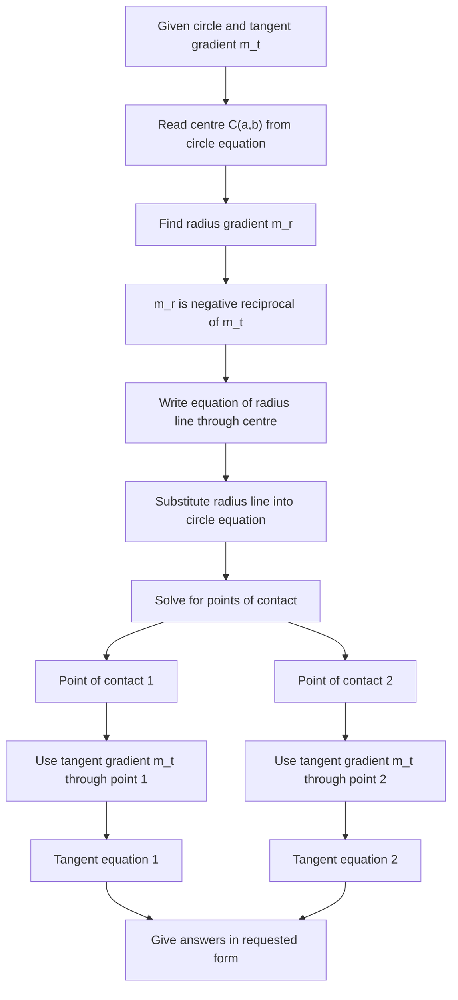

# AS1CoordinateGeometryCirclesMermaid-010

## Asset Metadata

| Field | Value |
|---|---|
| Asset ID | AS1CoordinateGeometryCirclesMermaid-010 |
| Unit code | AS1 |
| Topic code | AS1-CG |
| Topic name | Co-ordinate geometry in the \(x,y\) plane |
| Lesson focus | Circles |
| Source | Chapter 6 Circles PDF, page 18; Chapter 6 Circles transcript, Circles 5 |
| Related lesson section | Worked Example: Tangents with a given gradient |
| Purpose | Show how to find tangent equations when the tangent gradient is known but the points of contact are not. |
| CCEA alignment | AS1-CG-LO001, AS1-CG-LO003, AS1-CG-LO005, AS1-CG-LO007, AS1-CG-LO008 |

## Mermaid Diagram

