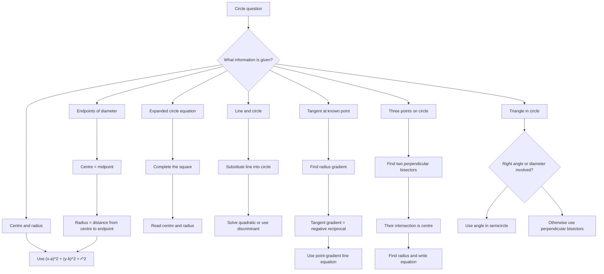

# AS1CoordinateGeometryCirclesMermaid-011

## Asset Metadata

| Field | Value |
|---|---|
| Asset ID | AS1CoordinateGeometryCirclesMermaid-011 |
| Unit code | AS1 |
| Topic code | AS1-CG |
| Topic name | Co-ordinate geometry in the \(x,y\) plane |
| Lesson focus | Circles |
| Source | Full Chapter 6 Circles PDF and transcript |
| Related lesson section | Exam Technique Notes |
| Purpose | Help students choose the correct method when a circle question starts with different information. |
| CCEA alignment | AS1-CG-LO001 to AS1-CG-LO008, plus AS1-AF-LO004 to AS1-AF-LO007 as support |

## Mermaid Diagram

