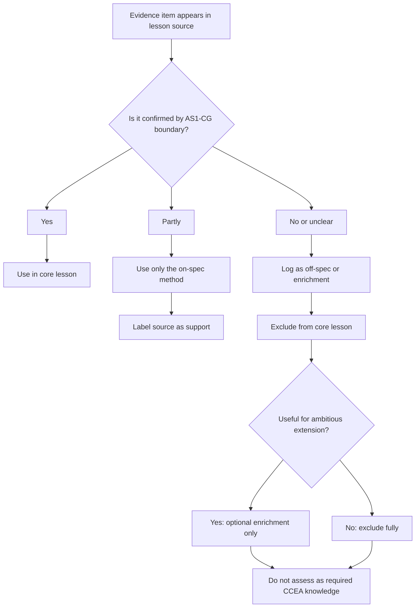

# AS1CoordinateGeometryCirclesMermaid-012

## Asset Metadata

| Field | Value |
|---|---|
| Asset ID | AS1CoordinateGeometryCirclesMermaid-012 |
| Unit code | AS1 |
| Topic code | AS1-CG |
| Topic name | Co-ordinate geometry in the \(x,y\) plane |
| Lesson focus | Circles |
| Source | Chapter 6 Circles PDF extension pages; CCEA specification map boundary |
| Related lesson section | Syllabus Gap Check; Supplementary Sources Used |
| Purpose | Control extension evidence so that cross-board/admissions-test material does not become required CCEA core content. |
| CCEA alignment | Evidence governance, not a new mathematical LO |

## Mermaid Diagram

