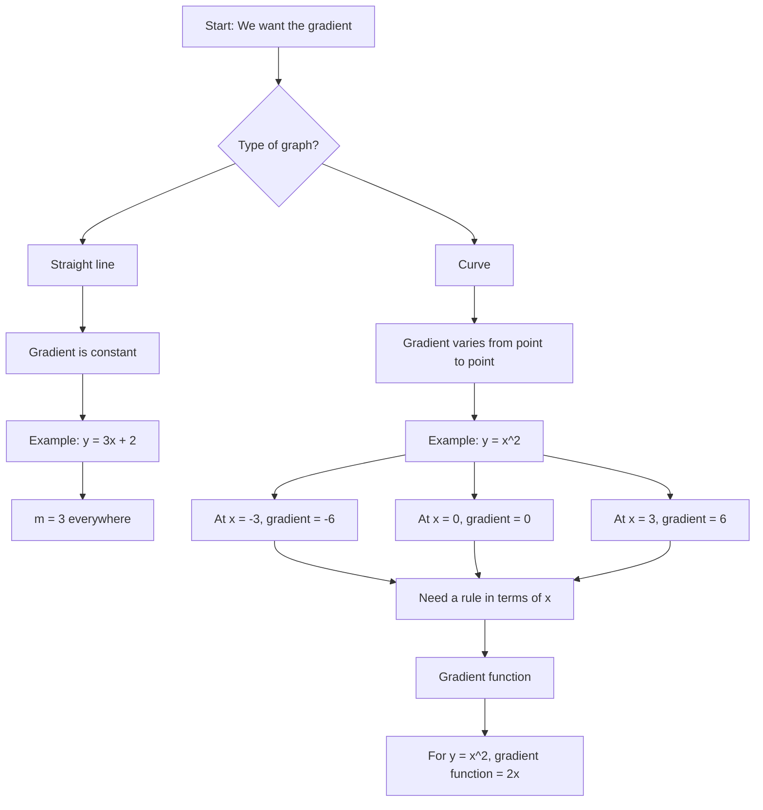

# AS1DifferentiationMERMAID-001

## Asset Metadata

- Asset ID: `AS1DifferentiationMERMAID-001`
- Asset type: Mermaid flowchart
- Source: CCEA AS1-DIFF specification map + Chapter 12 Differentiation PDF pp.2–3
- Related lesson section: Big Picture Explanation; Core Theory 1
- Purpose: Show why a curve needs a gradient function rather than a single gradient.
- Status: Final

