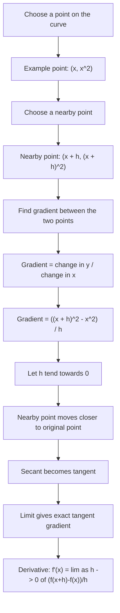

# AS1DifferentiationMERMAID-002

## Asset Metadata

- Asset ID: `AS1DifferentiationMERMAID-002`
- Asset type: Mermaid flowchart
- Source: Chapter 12 Differentiation PDF pp.4–6; transcript on first principles
- Related lesson section: Core Theory 2–5
- Purpose: Show the secant-to-tangent limit idea behind differentiation by first principles.
- Status: Final

