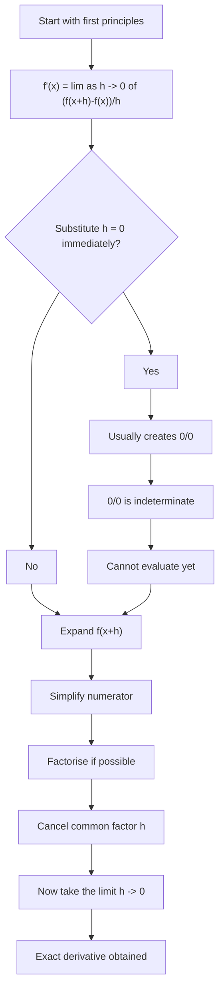

# AS1DifferentiationMERMAID-003

## Asset Metadata

- Asset ID: `AS1DifferentiationMERMAID-003`
- Asset type: Mermaid flowchart
- Source: Chapter 12 Differentiation PDF pp.5–10
- Related lesson section: Core Theory 3–4
- Purpose: Show the correct first-principles algebra route and the danger of substituting \(h=0\) too early.
- Status: Final

