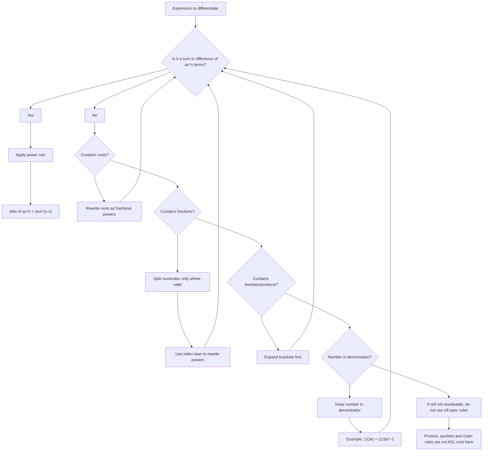

# AS1DifferentiationMERMAID-004

## Asset Metadata

- Asset ID: `AS1DifferentiationMERMAID-004`
- Asset type: Mermaid flowchart
- Source: CCEA AS1-DIFF-LO006 + Chapter 12 Differentiation PDF pp.11–20
- Related lesson section: Core Theory 7–13
- Purpose: Show the AS1 decision process for rewriting expressions before differentiating.
- Status: Final

