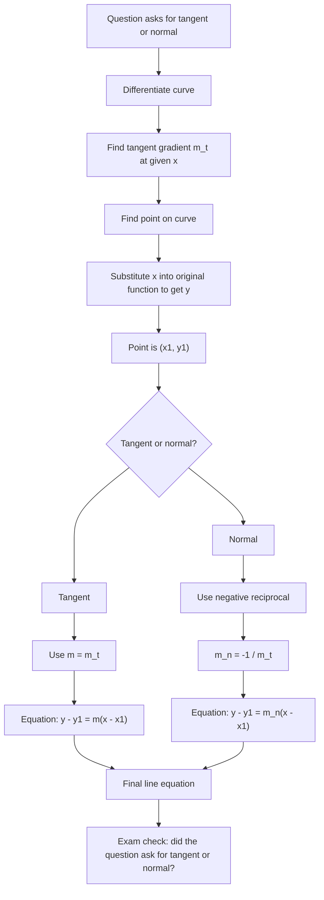

# AS1DifferentiationMERMAID-005

## Asset Metadata

- Asset ID: `AS1DifferentiationMERMAID-005`
- Asset type: Mermaid flowchart
- Source: Chapter 12 Differentiation PDF pp.21–23
- Related lesson section: Core Theory 14–16
- Purpose: Compare the method for finding tangents and normals to curves.
- Status: Final

