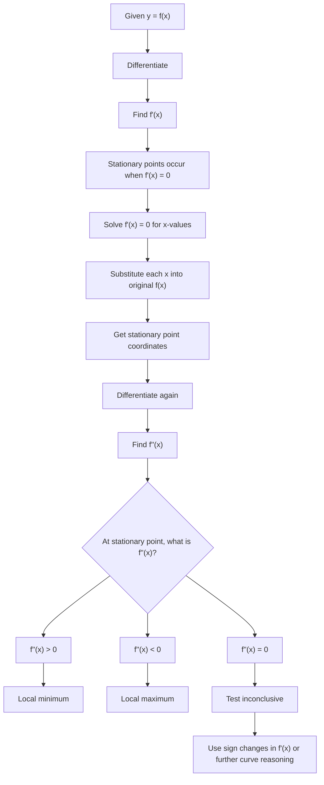

# AS1DifferentiationMERMAID-006

## Asset Metadata

- Asset ID: `AS1DifferentiationMERMAID-006`
- Asset type: Mermaid flowchart
- Source: CCEA AS1-DIFF-LO007 and LO008 + Chapter 12 Differentiation stationary-point evidence
- Related lesson section: Core Theory 17–21
- Purpose: Show how \(f'(x)\) and \(f''(x)\) are used to locate and classify stationary points.
- Status: Final

