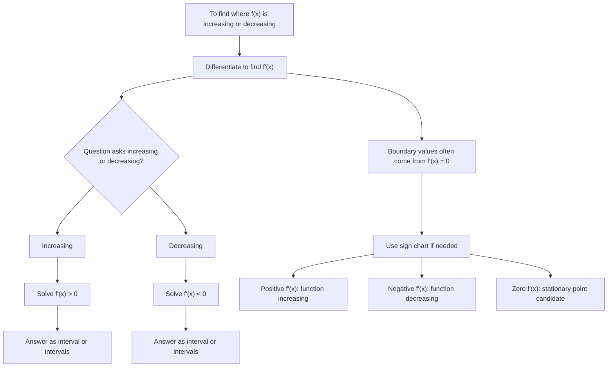

# AS1DifferentiationMERMAID-007

## Asset Metadata

- Asset ID: `AS1DifferentiationMERMAID-007`
- Asset type: Mermaid flowchart
- Source: CCEA AS1-DIFF-LO008 + Chapter 12 overview
- Related lesson section: Core Theory 17
- Purpose: Show how the sign of \(f'(x)\) determines increasing and decreasing intervals.
- Status: Final

