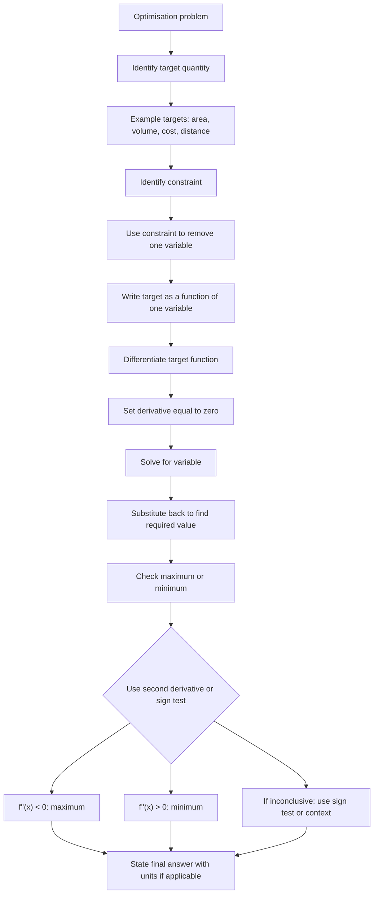

# AS1DifferentiationMERMAID-008

## Asset Metadata

- Asset ID: `AS1DifferentiationMERMAID-008`
- Asset type: Mermaid flowchart
- Source: CCEA AS1-DIFF-LO003 and LO007 + Chapter 12 optimisation/modelling evidence
- Related lesson section: Core Theory 23–25
- Purpose: Show the standard optimisation workflow for AS1 differentiation modelling problems.
- Status: Final

