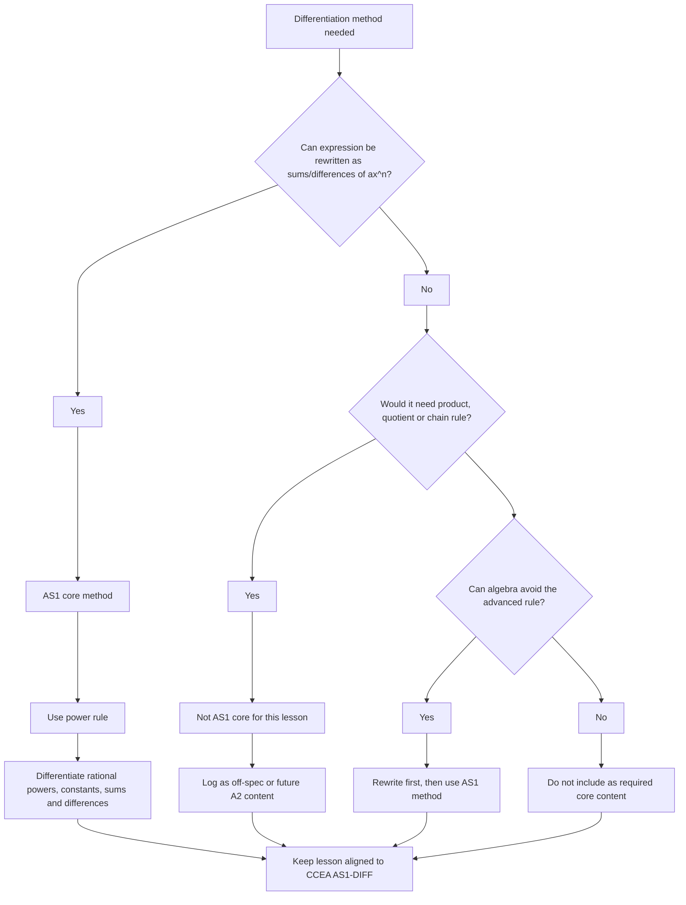

# AS1DifferentiationMERMAID-009

## Asset Metadata

- Asset ID: `AS1DifferentiationMERMAID-009`
- Asset type: Mermaid flowchart
- Source: CCEA AS1-DIFF boundary + A21 differentiation boundary comparison
- Related lesson section: Syllabus Gap Check; Off-Spec Content Found but Excluded
- Purpose: Make the AS1 boundary explicit by separating allowed AS1 methods from later A2 methods.
- Status: Final

