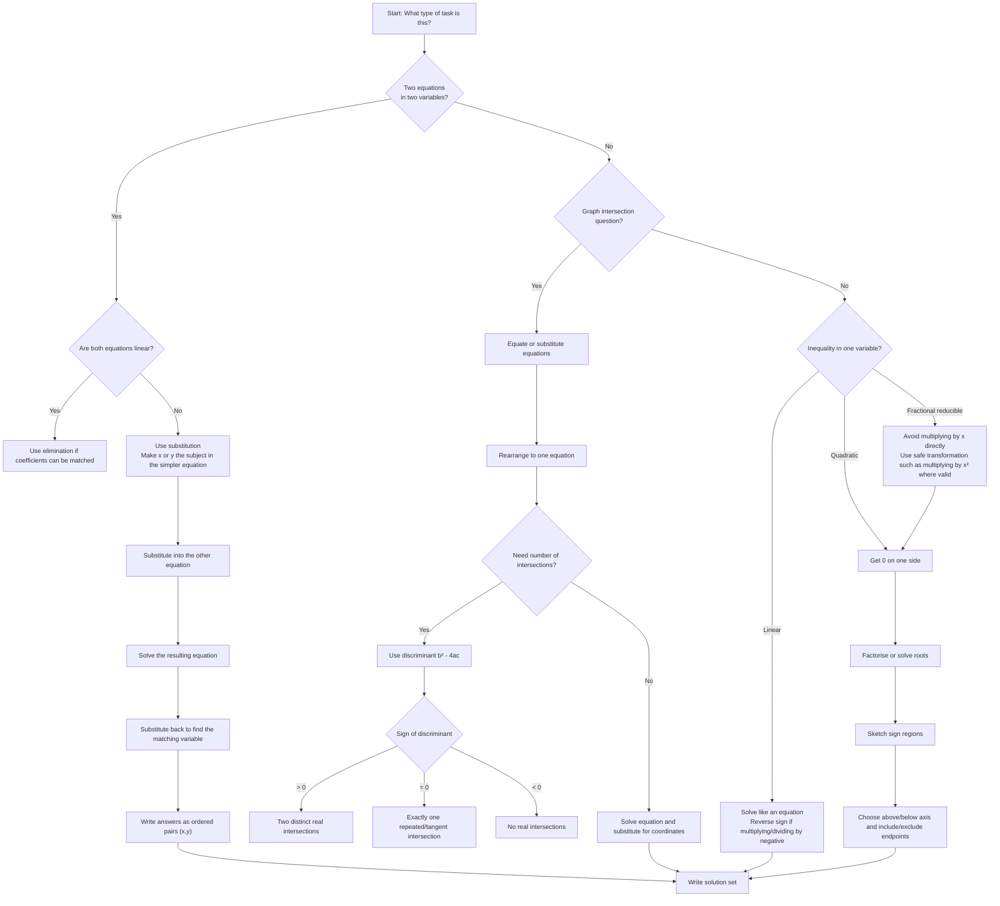

# AS1EquationsInequalitiesMermaid-001

## Asset ID
AS1EquationsInequalitiesMermaid-001

## Source
- CCEA GCE Mathematics Specification Map: AS1 Algebra and functions
- P1 Chapter 3: Equations and Inequalities PDF
- Chapter 3 Equations & Inequalities teacher transcript

## Related lesson section
Core Theory: Method Choice for Equations and Inequalities

## Purpose
Show the student which method to choose: elimination, substitution, discriminant, sketching or set-builder notation.

## Mermaid code

