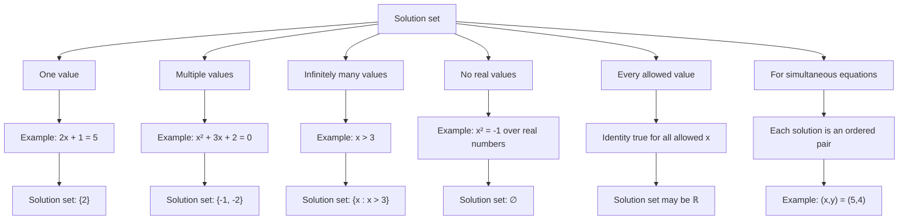

# AS1EquationsInequalitiesMermaid-002

## Asset ID
AS1EquationsInequalitiesMermaid-002

## Source
- P1 Chapter 3 PDF: Solution sets section
- Chapter 3 transcript: explanation of solution sets and simultaneous solution pairs

## Related lesson section
Key Definitions and Notation: Solution Sets

## Purpose
Classify possible solution-set sizes: one value, multiple values, infinite values, empty set and all real values.

## Mermaid code

