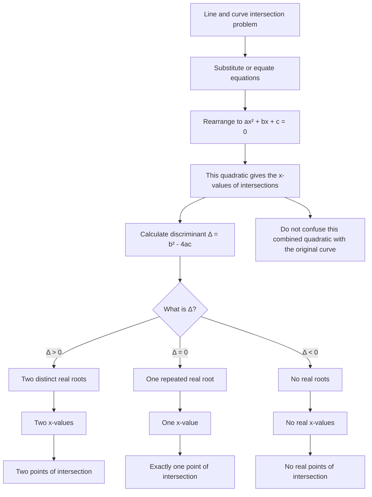

# AS1EquationsInequalitiesMermaid-003

## Asset ID
AS1EquationsInequalitiesMermaid-003

## Source
- CCEA AS1-AF-LO004: discriminant of a quadratic function
- P1 Chapter 3 PDF: simultaneous equations using graphs and discriminant examples
- Chapter 3 transcript: warning that the combined quadratic represents intersection x-values

## Related lesson section
Core Theory: Graph Intersections and the Discriminant

## Purpose
Show how the discriminant controls the number of real roots and therefore the number of graph intersections.

## Mermaid code

