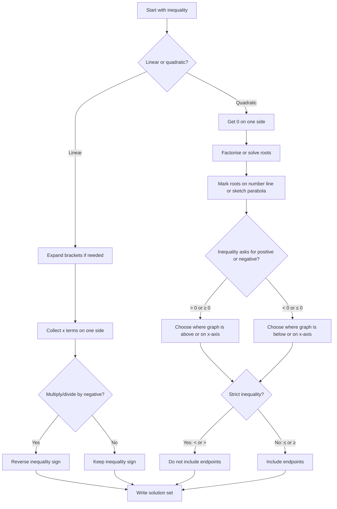

# AS1EquationsInequalitiesMermaid-004

## Asset ID
AS1EquationsInequalitiesMermaid-004

## Source
- CCEA AS1-AF-LO009: linear and quadratic inequalities in one variable
- P1 Chapter 3 PDF: recap of linear inequalities and solving quadratic inequalities
- Chapter 3 transcript: emphasis on sketching and reasoning

## Related lesson section
Core Theory: Linear and Quadratic Inequalities

## Purpose
Give a repeatable workflow for solving inequalities without losing signs and endpoints.

## Mermaid code

