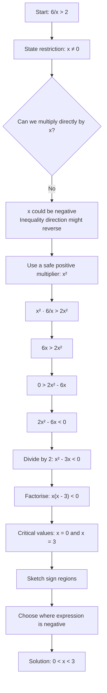

# AS1EquationsInequalitiesMermaid-005

## Asset ID
AS1EquationsInequalitiesMermaid-005

## Source
- CCEA AS1-AF-LO009: inequalities with fractions reducible to linear/quadratic inequalities
- P1 Chapter 3 PDF: fractional inequality example
- Chapter 3 transcript: warning that multiplying directly by x is unsafe when x may be negative

## Related lesson section
Core Theory: Inequalities Involving Division by x

## Purpose
Show the safe route for fractional inequalities such as 6/x > 2, including the domain restriction.

## Mermaid code

