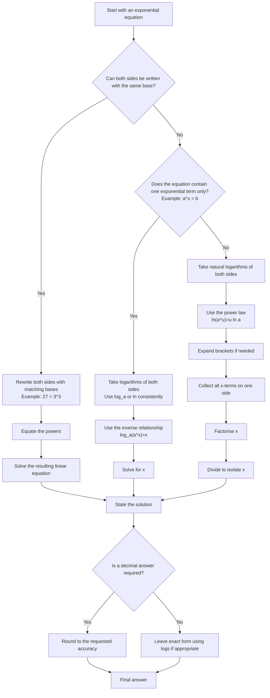

# AS1ExponentialsAndLogarithmsMermaid-001

## Asset Metadata

| Field | Value |
|---|---|
| Asset ID | AS1ExponentialsAndLogarithmsMermaid-001 |
| Asset type | Mermaid diagram |
| Suggested file path | `mermaid/AS1ExponentialsAndLogarithmsMermaid-001.md` |
| Unit code | AS1 |
| Topic code | AS1-EXPLOG |
| Topic name | Exponentials and logarithms |
| Related lesson section | Core Theory 17-19; Worked Examples 7-9; Exam Technique Notes |
| Source | CCEA AS1 Exponentials and logarithms specification boundary; Chapter 14 lesson PDF and transcript |
| Purpose | Show a decision flow for solving exponential equations, including matching bases, taking logarithms, and collecting $x$-terms. |

