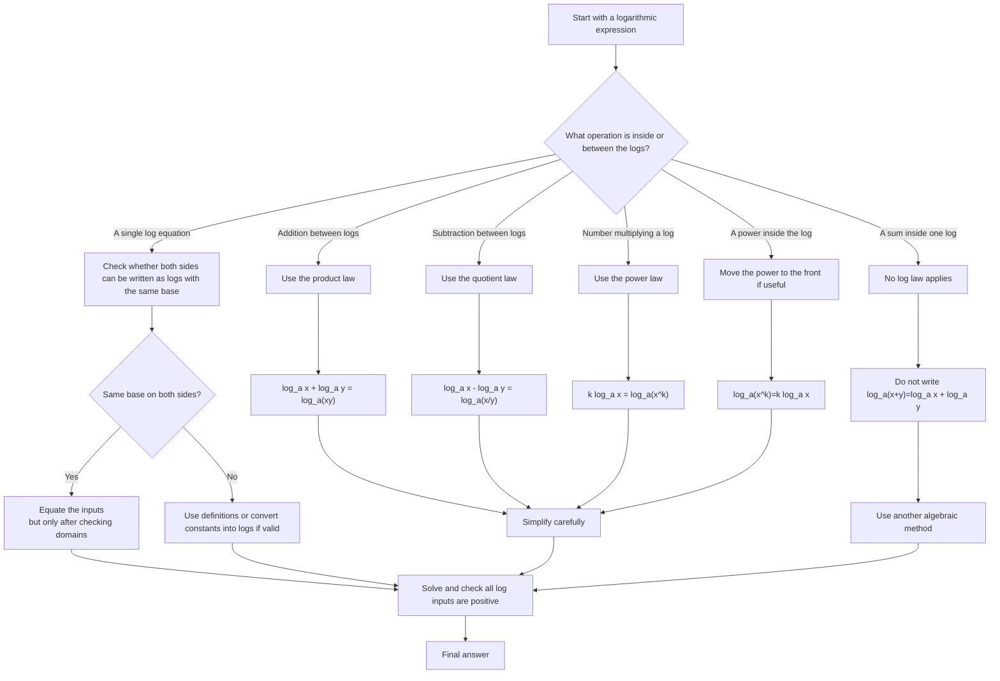

# AS1ExponentialsAndLogarithmsMermaid-002

## Asset Metadata

| Field | Value |
|---|---|
| Asset ID | AS1ExponentialsAndLogarithmsMermaid-002 |
| Asset type | Mermaid diagram |
| Suggested file path | `mermaid/AS1ExponentialsAndLogarithmsMermaid-002.md` |
| Unit code | AS1 |
| Topic code | AS1-EXPLOG |
| Topic name | Exponentials and logarithms |
| Related lesson section | Core Theory 12-16; Worked Example 6; Guided Practice 4-5 |
| Source | CCEA AS1 Exponentials and logarithms specification boundary; Chapter 14 lesson PDF and transcript |
| Purpose | Help students choose the correct logarithm law and avoid false laws such as splitting a logarithm of a sum. |

