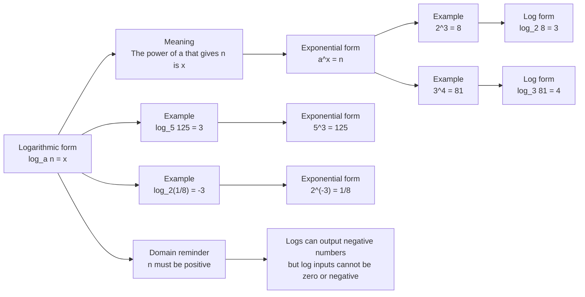

# AS1ExponentialsAndLogarithmsMermaid-004

## Asset Metadata

| Field | Value |
|---|---|
| Asset ID | AS1ExponentialsAndLogarithmsMermaid-004 |
| Asset type | Mermaid diagram |
| Suggested file path | `mermaid/AS1ExponentialsAndLogarithmsMermaid-004.md` |
| Unit code | AS1 |
| Topic code | AS1-EXPLOG |
| Topic name | Exponentials and logarithms |
| Related lesson section | Core Theory 8-11; Worked Example 5; Natural logarithm examples |
| Source | CCEA AS1 Exponentials and logarithms specification boundary; Chapter 14 lesson PDF and transcript |
| Purpose | Show how logarithmic form and exponential form convert into each other. |

