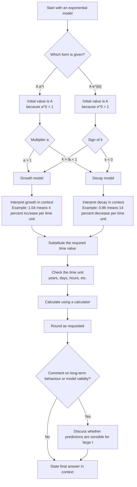

# AS1ExponentialsAndLogarithmsMermaid-005

## Asset Metadata

| Field | Value |
|---|---|
| Asset ID | AS1ExponentialsAndLogarithmsMermaid-005 |
| Asset type | Mermaid diagram |
| Suggested file path | `mermaid/AS1ExponentialsAndLogarithmsMermaid-005.md` |
| Unit code | AS1 |
| Topic code | AS1-EXPLOG |
| Topic name | Exponentials and logarithms |
| Related lesson section | Core Theory 22; Worked Examples 10-11; Guided Practice 11-12 |
| Source | CCEA AS1 Exponentials and logarithms specification boundary; Chapter 14 lesson PDF and transcript |
| Purpose | Show how to interpret and use exponential growth and decay models. |

