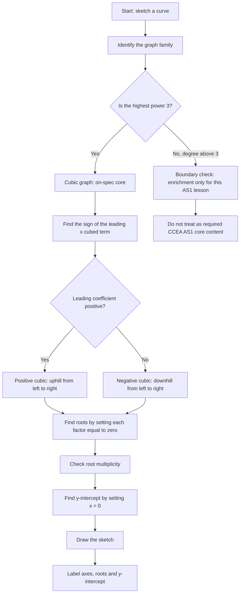

# AS1GraphsTransformationsMermaid-001

## Asset ID
`AS1GraphsTransformationsMermaid-001`

## Source
CCEA AS1-AF-LO012 and DrFrost Chapter 4 polynomial/cubic graph evidence.

## Related Lesson Section
Core Theory → Polynomial Graph Shape  
Worked Examples → Cubic Sketching

## Purpose
Show the cubic sketching routine: identify family, shape, roots, multiplicity and `y`-intercept.

