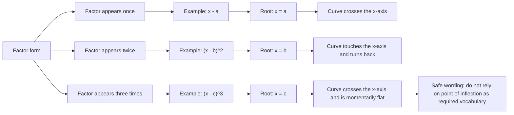

# AS1GraphsTransformationsMermaid-002

## Asset ID
`AS1GraphsTransformationsMermaid-002`

## Source
DrFrost cubic examples and transcript explanation of simple, repeated and triple repeated roots.

## Related Lesson Section
Key Definitions and Notation → Root  
Core Theory → Repeated Roots  
Worked Examples → Cubics with Repeated Roots

## Purpose
Show how factor powers control behaviour at the `x`-axis.

