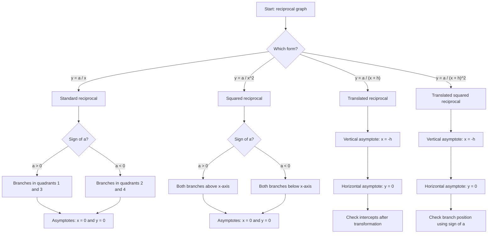

# AS1GraphsTransformationsMermaid-003

## Asset ID
`AS1GraphsTransformationsMermaid-003`

## Source
CCEA AS1-AF-LO013 and DrFrost reciprocal graph evidence.

## Related Lesson Section
Core Theory → Reciprocal Graphs

## Purpose
Classify reciprocal graphs and identify asymptotes.

