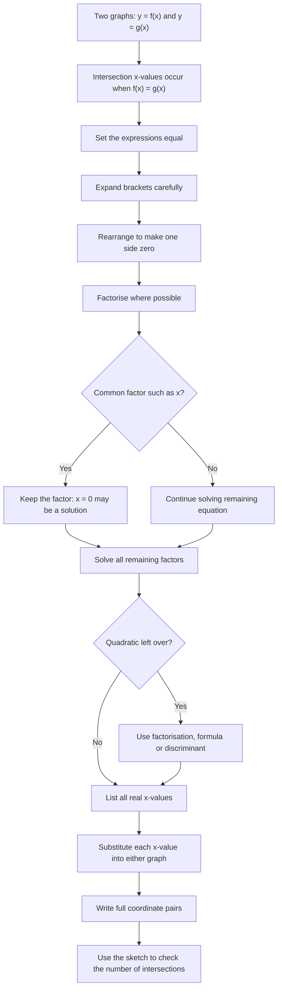

# AS1GraphsTransformationsMermaid-004

## Asset ID
`AS1GraphsTransformationsMermaid-004`

## Source
CCEA AS1-AF-LO014 and AS1-AF-LO015 plus DrFrost intersections evidence.

## Related Lesson Section
Core Theory → Points of Intersection

## Purpose
Show the full intersection-solving workflow, including the “do not divide by `x`” trap.

