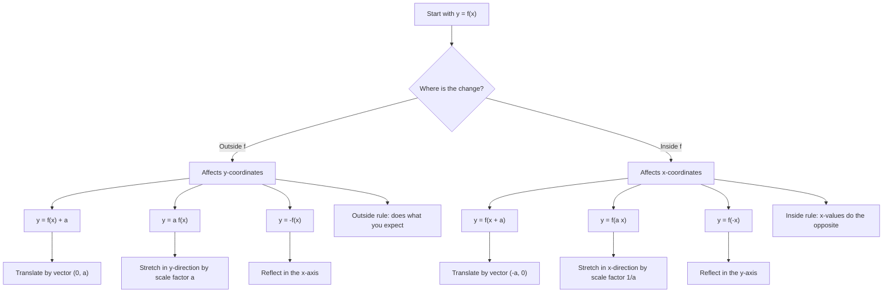

# AS1GraphsTransformationsMermaid-005

## Asset ID
`AS1GraphsTransformationsMermaid-005`

## Source
CCEA AS1-AF-LO016 and DrFrost transformation summary evidence.

## Related Lesson Section
Core Theory → Transformations of Graphs

## Purpose
Summarise AS1 graph transformations and coordinate effects.

