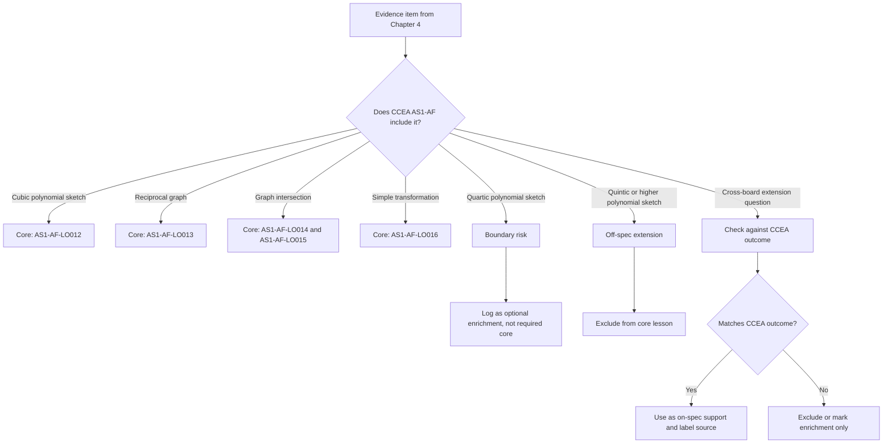

# AS1GraphsTransformationsMermaid-006

## Asset ID
`AS1GraphsTransformationsMermaid-006`

## Source
CCEA AS1-AF boundary and DrFrost Chapter 4.

## Related Lesson Section
Syllabus Gap Check

## Purpose
Control what becomes core lesson content versus enrichment.

