# AS1IntegrationMER-001

## Asset Metadata

| Field | Value |
|---|---|
| asset_id | AS1IntegrationMER-001 |
| asset_type | Mermaid diagram |
| unit_code | AS1 |
| topic_code | AS1-INT |
| topic_name | Integration |
| related_lesson_file | AS1_integration_lesson.md |
| related_lesson_section | Core Theory: Section 1 - Integration as reverse differentiation |
| related_LOs | AS1-INT-LO001, AS1-INT-LO002 |
| source | CCEA GCE Mathematics Specification Map; P1 Chapter 13 Integration PDF; Chapter 13 Integration teacher transcript |
| purpose | Show that integration reverses differentiation: differentiation multiplies by the power and reduces the power by 1, while integration increases the power by 1 and divides by the new power. |
| phase_status | Written |
| off_spec_notes | None. This diagram stays within AS1 Integration. |

## Mermaid Code

```mermaid
flowchart LR
    A["Function<br/>5x^3"] --> B["Differentiate"]
    B --> C["Multiply by the power<br/>5 × 3x^3"]
    C --> D["Reduce the power by 1<br/>x^3 to x^2"]
    D --> E["Gradient function<br/>15x^2"]

    E --> F["Integrate"]
    F --> G["Increase the power by 1<br/>x^2 to x^3"]
    G --> H["Divide by the new power<br/>15/3 x^3"]
    H --> I["Original family<br/>5x^3 + c"]

    I --> J["Why +c?"]
    J --> K["Constants disappear when differentiated"]

    classDef process fill:#f5f5f5,stroke:#333,stroke-width:1px;
    classDef key fill:#e8f4ff,stroke:#1b4f72,stroke-width:1px;
    classDef warning fill:#fff4e6,stroke:#b9770e,stroke-width:1px;

    class B,F process;
    class A,E,I key;
    class J,K warning;
```

