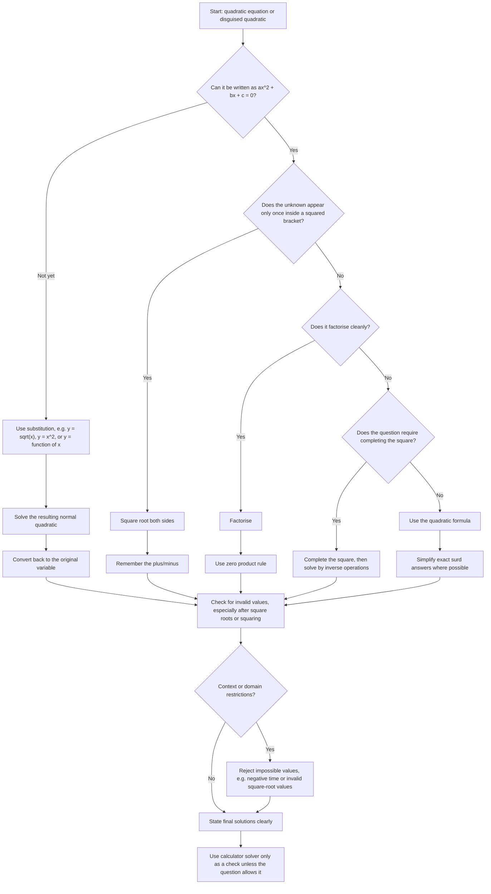

# AS1QuadraticsMermaid-001

## Asset Metadata

| Field | Value |
|---|---|
| asset_id | AS1QuadraticsMermaid-001 |
| asset_type | Mermaid flowchart |
| lesson | AS1 Quadratics |
| related lesson section | Core Theory Part A; Consolidated Exam Technique |
| source | CCEA AS1-AF-LO006; lesson PDF solving quadratics section; teacher transcript video 1 |
| purpose | Help students choose a suitable method for solving a quadratic equation. |

