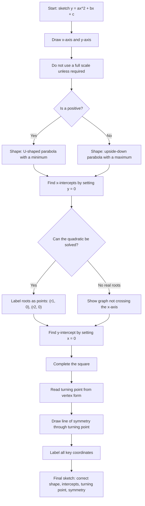

# AS1QuadraticsMermaid-002

## Asset Metadata

| Field | Value |
|---|---|
| asset_id | AS1QuadraticsMermaid-002 |
| asset_type | Mermaid flowchart |
| lesson | AS1 Quadratics |
| related lesson section | Core Theory Part F – Sketching Quadratic Graphs |
| source | CCEA AS1-AF-LO003, AS1-AF-LO012, AS1-AF-LO014; lesson PDF quadratic graphs section; teacher transcript video 7 |
| purpose | Provide a graph-sketching checklist for a quadratic such as `y=x^2+4x-5`. |

