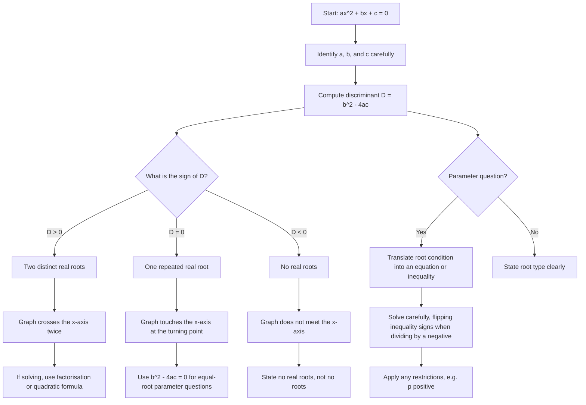

# AS1QuadraticsMermaid-003

## Asset Metadata

| Field | Value |
|---|---|
| asset_id | AS1QuadraticsMermaid-003 |
| asset_type | Mermaid decision tree |
| lesson | AS1 Quadratics |
| related lesson section | Core Theory Part H – The Discriminant |
| source | CCEA AS1-AF-LO004; lesson PDF discriminant section; teacher transcript discriminant work |
| purpose | Connect `b^2-4ac` to root type and graph behaviour. |

