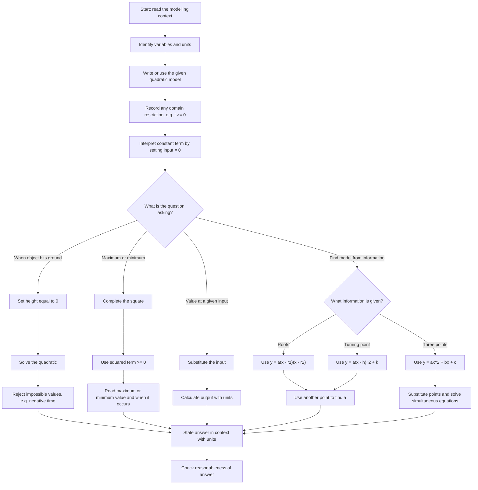

# AS1QuadraticsMermaid-004

## Asset Metadata

| Field | Value |
|---|---|
| asset_id | AS1QuadraticsMermaid-004 |
| asset_type | Mermaid modelling workflow |
| lesson | AS1 Quadratics |
| related lesson section | Core Theory Part I – Modelling with Quadratics |
| source | Lesson PDF “Why do we care about quadratics?” pages and transcript modelling section |
| purpose | Show how to move from a real-world quadratic model to algebraic answers and contextual interpretation. |

