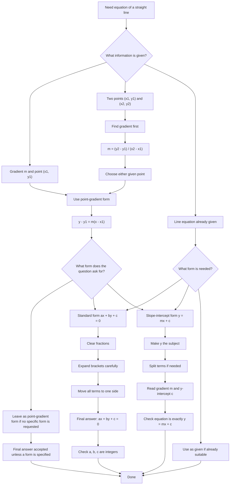

# AS1StraightLineGraphsMermaid-001

## Asset ID

`AS1StraightLineGraphsMermaid-001`

## Source

- `P1-Chp5-StraightLineGraphs_RevealBlocksRemoved.pdf`
- `Chapter_5_Straight_Line_Graphs_🤖_(Pure_Year_1)_Transcript.md`
- CCEA GCE Mathematics Specification Map: AS1-CG-LO001

## Related lesson section

Core Theory, Section 8: Deriving \(y-y_1=m(x-x_1)\)  
Core Theory, Section 9: Equation of a line through two points

## Purpose

Show the decision route for finding the equation of a straight line.

