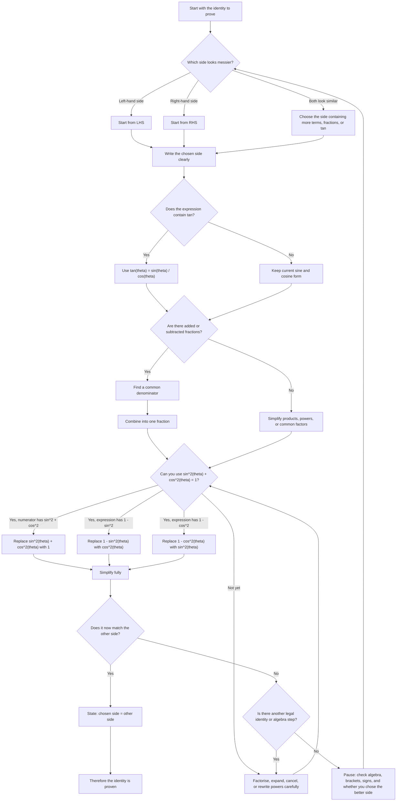

# Mermaid Asset: AS1TrigIdentitiesMER-001

## Asset Metadata

| Field | Value |
|---|---|
| asset_id | AS1TrigIdentitiesMER-001 |
| asset_type | Mermaid flowchart |
| unit_code | AS1 |
| topic_code | AS1-TRIG |
| topic_name | Trigonometric Identities and Equations |
| related_lesson_file | AS1_trigonometric_identities_and_equations_lesson.md |
| related_lesson_section | Core Theory: Proof strategy for identities; Worked Examples: identity proofs |
| source | CCEA AS1 Trigonometry specification boundary + Chapter 10 lesson PDF pages 12-15 + transcript videos 8-10 |
| purpose | Show a student decision path for proving trigonometric identities using \(\tan\theta=\frac{\sin\theta}{\cos\theta}\), \(\sin^2\theta+\cos^2\theta=1\), algebraic fraction combining, and final RHS matching. |
| status | Written |
| off_spec_notes | None. This is core AS1 content because the CCEA AS1 trigonometry boundary includes using \(\sin^2\theta+\cos^2\theta=1\) for proving identities. |

## Mermaid Code

## Student-Facing Caption

When proving a trigonometric identity, do not try to solve for \(\theta\). An identity proof is a tidy-up mission: choose one side, usually the messier side, then rewrite it until it becomes the other side.

The main moves in this chapter are:

\[
\tan\theta=\frac{\sin\theta}{\cos\theta},
\]

\[
\sin^2\theta+\cos^2\theta=1,
\]

\[
1-\sin^2\theta=\cos^2\theta,
\]

\[
1-\cos^2\theta=\sin^2\theta.
\]

The final line should clearly show \(\text{LHS}=\text{RHS}\).
