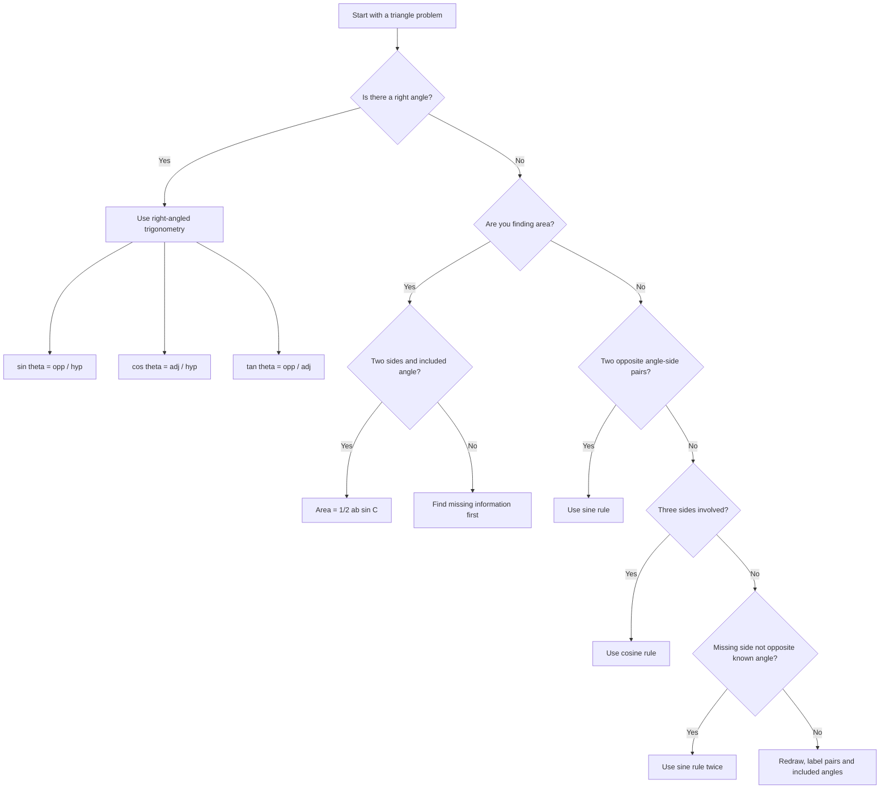

# AS1TrigonometricRatiosMER-001

Source: P1-Chp9-TrigonometricRatios.pdf p.6  
Related section: Choosing the Correct Rule  
Purpose: Decision flowchart for selecting the triangle method.

```mermaid
flowchart TD
    A[Start with a triangle problem] --> B{Is there a right angle?}
    B -->|Yes| C[Use right-angled trigonometry]
    C --> C1[sin theta = opp / hyp]
    C --> C2[cos theta = adj / hyp]
    C --> C3[tan theta = opp / adj]
    B -->|No| D{Are you finding area?}
    D -->|Yes| E{Two sides and included angle?}
    E -->|Yes| F[Area = 1/2 ab sin C]
    E -->|No| G[Find missing information first]
    D -->|No| H{Two opposite angle-side pairs?}
    H -->|Yes| I[Use sine rule]
    H -->|No| J{Three sides involved?}
    J -->|Yes| K[Use cosine rule]
    J -->|No| L{Missing side not opposite known angle?}
    L -->|Yes| M[Use sine rule twice]
    L -->|No| N[Redraw, label pairs and included angles]
```
