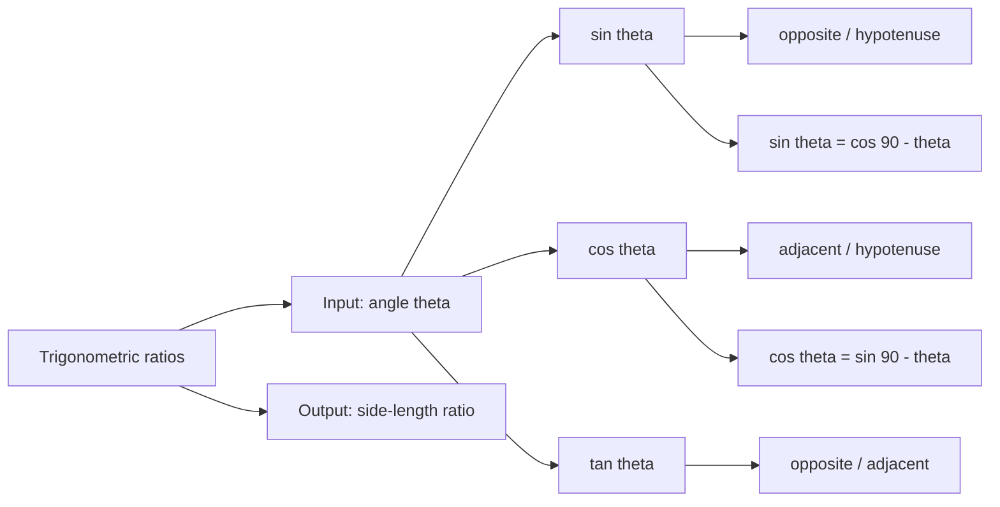

# AS1TrigonometricRatiosMER-002

Source: P1-Chp9-TrigonometricRatios.pdf pp.4-5  
Related section: Key Definitions and Notation  
Purpose: Concept map for trigonometric ratios.

```mermaid
flowchart LR
    A[Trigonometric ratios] --> B[Input: angle theta]
    A --> C[Output: side-length ratio]
    B --> D[sin theta]
    B --> E[cos theta]
    B --> F[tan theta]
    D --> D1[opposite / hypotenuse]
    E --> E1[adjacent / hypotenuse]
    F --> F1[opposite / adjacent]
    E --> G[cos theta = sin 90 - theta]
    D --> H[sin theta = cos 90 - theta]
```
