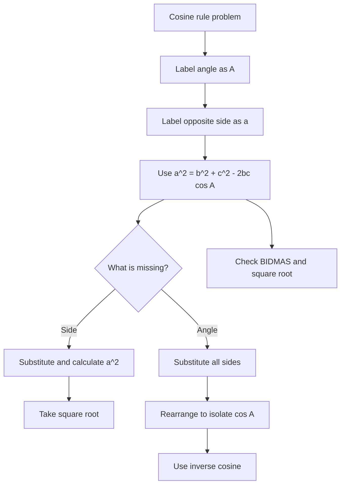

# AS1TrigonometricRatiosMER-003

Source: P1-Chp9-TrigonometricRatios.pdf pp.7-10  
Related section: Cosine Rule  
Purpose: Workflow for missing sides and missing angles.

```mermaid
flowchart TD
    A[Cosine rule problem] --> B[Label angle as A]
    B --> C[Label opposite side as a]
    C --> D[Use a^2 = b^2 + c^2 - 2bc cos A]
    D --> E{What is missing?}
    E -->|Side| F[Substitute and calculate a^2]
    F --> G[Take square root]
    E -->|Angle| H[Substitute all sides]
    H --> I[Rearrange to isolate cos A]
    I --> J[Use inverse cosine]
    D --> K[Check BIDMAS and square root]
```
