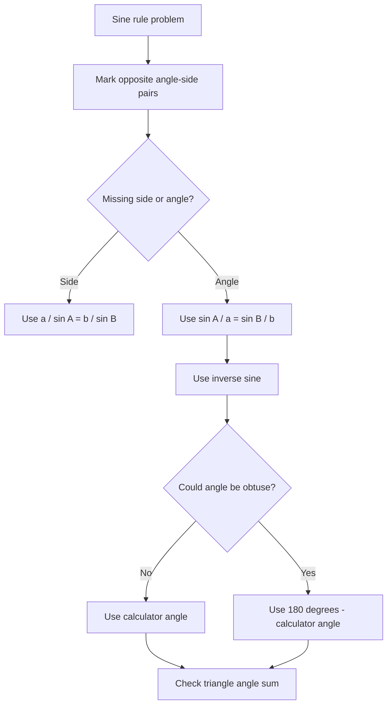

# AS1TrigonometricRatiosMER-004

Source: P1-Chp9-TrigonometricRatios.pdf pp.13-18  
Related section: Sine Rule and Ambiguous Case  
Purpose: Workflow for sine rule, including the second possible angle.

