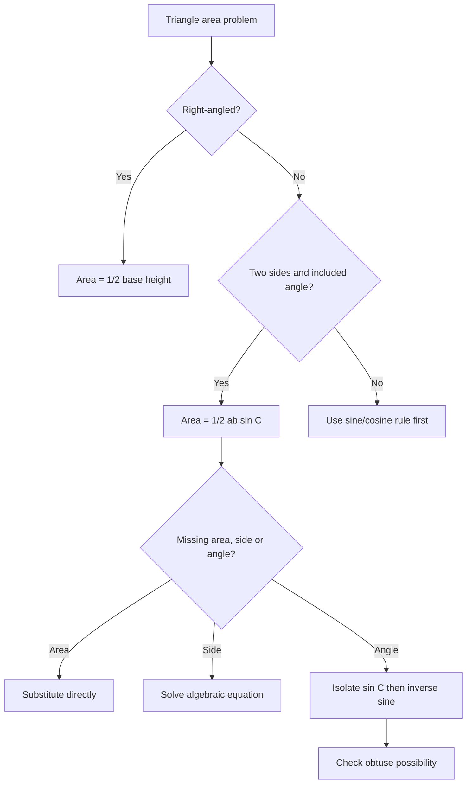

# AS1TrigonometricRatiosMER-005

Source: P1-Chp9-TrigonometricRatios.pdf pp.20-21  
Related section: Area Formula  
Purpose: Decision flow for \(\frac12ab\sin C\).

```mermaid
flowchart TD
    A[Triangle area problem] --> B{Right-angled?}
    B -->|Yes| C[Area = 1/2 base height]
    B -->|No| D{Two sides and included angle?}
    D -->|Yes| E[Area = 1/2 ab sin C]
    D -->|No| F[Use sine/cosine rule first]
    E --> G{Missing area, side or angle?}
    G -->|Area| H[Substitute directly]
    G -->|Side| I[Solve algebraic equation]
    G -->|Angle| J[Isolate sin C then inverse sine]
    J --> K[Check obtuse possibility]
```
