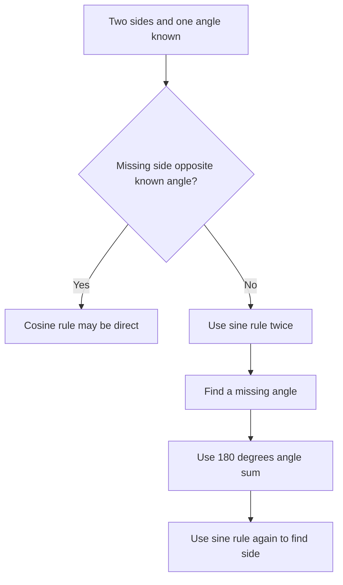

# AS1TrigonometricRatiosMER-006

Source: P1-Chp9-TrigonometricRatios.pdf pp.23-24  
Related section: Sine Rule Twice  
Purpose: Workflow for using sine rule twice.

```mermaid
flowchart TD
    A[Two sides and one angle known] --> B{Missing side opposite known angle?}
    B -->|Yes| C[Cosine rule may be direct]
    B -->|No| D[Use sine rule twice]
    D --> E[Find a missing angle]
    E --> F[Use 180 degrees angle sum]
    F --> G[Use sine rule again to find side]
```
