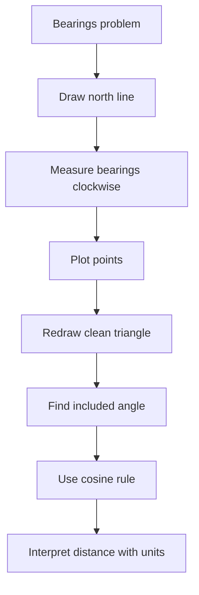

# AS1TrigonometricRatiosMER-007

Source: P1-Chp9-TrigonometricRatios.pdf p.9  
Related section: Bearings  
Purpose: Bearings problem-solving flow.

```mermaid
flowchart TD
    A[Bearings problem] --> B[Draw north line]
    B --> C[Measure bearings clockwise]
    C --> D[Plot points]
    D --> E[Redraw clean triangle]
    E --> F[Find included angle]
    F --> G[Use cosine rule]
    G --> H[Interpret distance with units]
```
