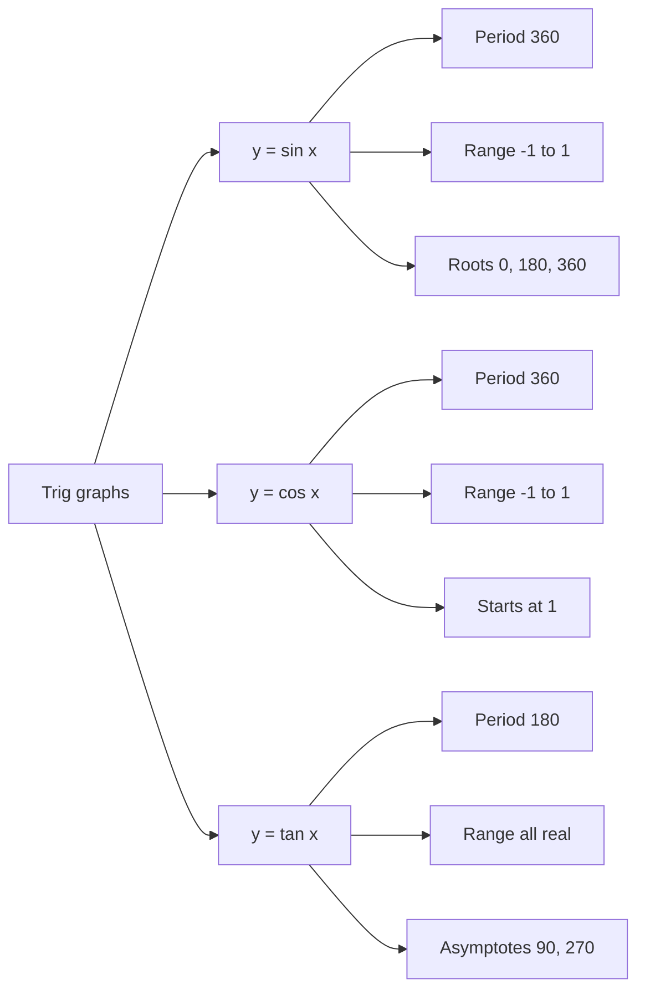

# AS1TrigonometricRatiosMER-008

Source: P1-Chp9-TrigonometricRatios.pdf pp.31-36  
Related section: Trig Graphs  
Purpose: Feature map for sine, cosine and tangent.

```mermaid
flowchart LR
    A[Trig graphs] --> B[y = sin x]
    A --> C[y = cos x]
    A --> D[y = tan x]
    B --> B1[Period 360]
    B --> B2[Range -1 to 1]
    B --> B3[Roots 0, 180, 360]
    C --> C1[Period 360]
    C --> C2[Range -1 to 1]
    C --> C3[Starts at 1]
    D --> D1[Period 180]
    D --> D2[Range all real]
    D --> D3[Asymptotes 90, 270]
```
