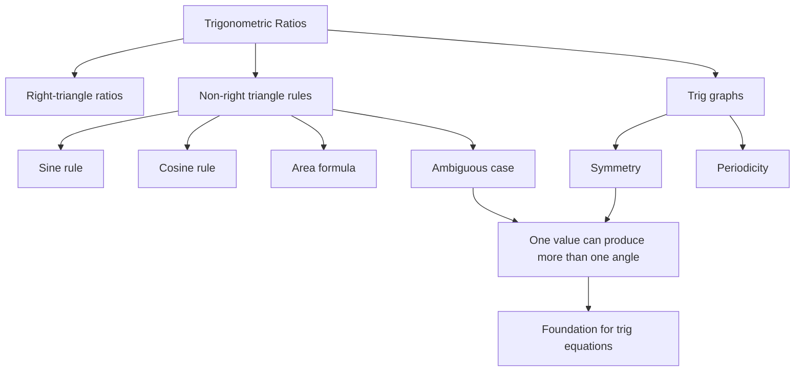

# AS1TrigonometricRatiosMER-010

Source: P1-Chp9-TrigonometricRatios.pdf overview and graph sections  
Related section: Big Picture  
Purpose: Concept bridge from ratios to graphs and trig equations.

