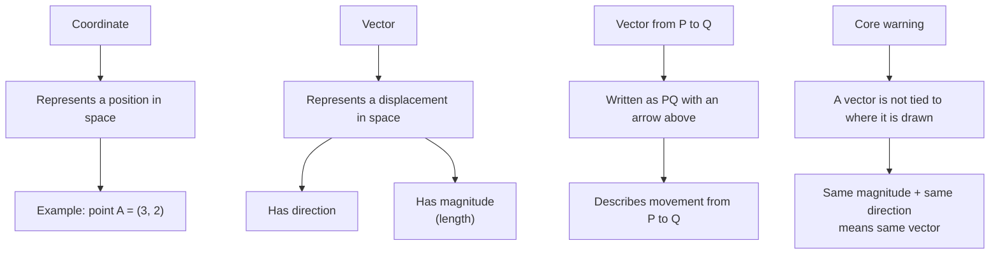

# AS1VectorsMermaid-001

## Asset ID
AS1VectorsMermaid-001

## Source
P1-Chp11-Vectors.pdf, Vector Basics slide; Chapter_11_Vectors transcript.

## Related lesson section
Key Definitions and Notation; Core Theory: Vector Basics.

## Purpose
Show the conceptual difference between a coordinate and a vector, and emphasise that a vector has magnitude and direction.

