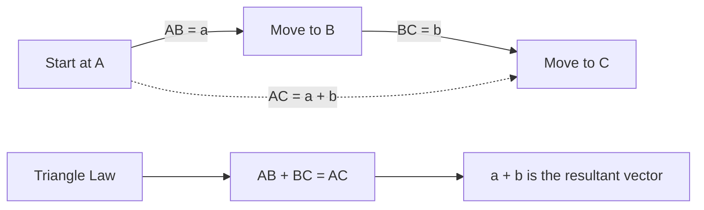

# AS1VectorsMermaid-002

## Asset ID
AS1VectorsMermaid-002

## Source
P1-Chp11-Vectors.pdf, Vector Basics slide; Chapter_11_Vectors transcript.

## Related lesson section
Core Theory: Vector addition; Worked Example 1.

## Purpose
Show the triangle law for vector addition and the meaning of a resultant vector.

