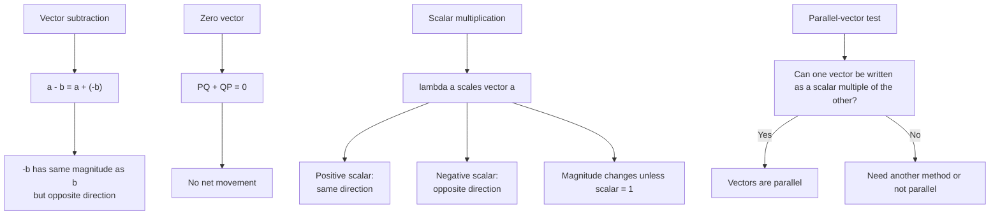

# AS1VectorsMermaid-003

## Asset ID
AS1VectorsMermaid-003

## Source
P1-Chp11-Vectors.pdf, Vector Basics slide on subtraction, zero vector and scalars.

## Related lesson section
Core Theory: Vector subtraction; Scalar multiplication; Parallel vectors.

## Purpose
Show the logic chain connecting vector subtraction, negation, scalar multiplication and parallel-vector proof.

