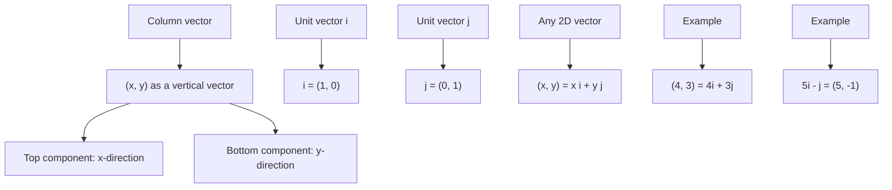

# AS1VectorsMermaid-004

## Asset ID
AS1VectorsMermaid-004

## Source
P1-Chp11-Vectors.pdf, Representing Vectors slide.

## Related lesson section
Key Definitions and Notation; Core Theory: Component form and i, j form.

## Purpose
Show how a 2D vector can be written in column form and in i, j notation.

